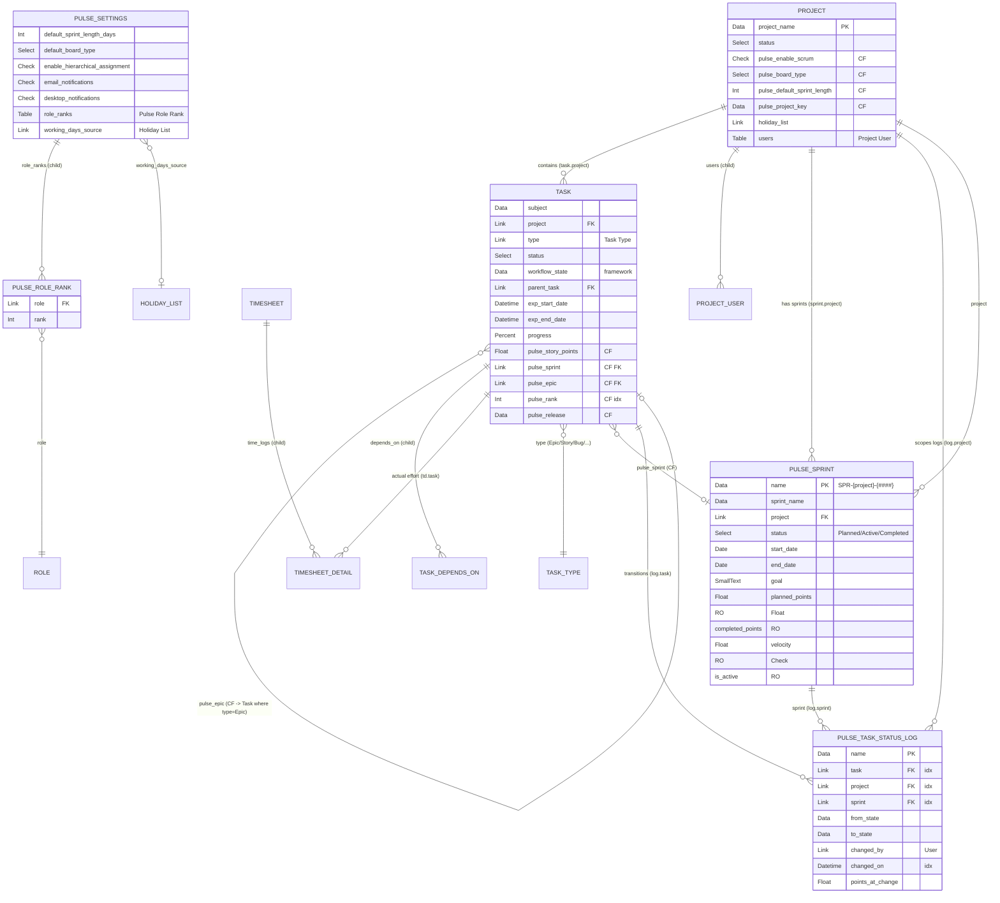

# Pulse — Database Design

**Document 6 of 21 · Database Design**
**Product:** Pulse — Modern Project Management for ERPNext
**Platform:** Frappe **v16.25** · ERPNext **v16.26**
**Module:** Pulse · **App:** `pulse`
**Status:** Design. Conforms to `00-Pulse-Enterprise-Analysis.md` (§18, §22) and `_canonical-model.md` (§1–§11). Any deviation must update the canonical model first.

---

## 0. Scope & source of truth

This document specifies the **physical and logical data design** for Pulse: which existing ERPNext/Frappe tables are reused, which columns (Custom Fields) are added to them, the small set of new DocTypes, their full field specs, relationships, indexing, the status-log design that powers agile metrics, a data dictionary, and a migration plan away from the deprecated parallel `Pulse *` doctypes.

Governing rule (inherited): **Reuse ERPNext → Extend ERPNext → Build new (only if no equivalent).** The consequence for the database is stated in §1.

Verified against live schema:
- ERPNext **Task** (`erpnext/projects/doctype/task/task.json`): title field is `subject` (Data, reqd, `search_index`); `project` (Link→Project, `search_index`); `type` (Link→**Task Type**); `status` (Select: `Open, Working, Pending Review, Overdue, Template, Completed, Cancelled`); `priority`; `parent_task` (Link→Task, `search_index`); `is_group`, `is_milestone`; `exp_start_date`/`exp_end_date` (**Datetime**, `exp_end_date` has `search_index`); `expected_time` (Float); `progress` (Percent); `depends_on`/`depends_on_tasks` (Task Depends On child); `act_start_date`/`act_end_date`, `actual_time`; costing roll-ups `total_costing_amount`/`total_billing_amount`; `company`, `department`; NestedSet `lft`/`rgt`. Autoname `TASK-.YYYY.-.#####`.
- ERPNext **Project** (`.../project/project.json`): `project_name` (Data, reqd, unique); `status` (Open/Completed/Cancelled); `percent_complete`; costing tab; `holiday_list`; `users` (Table→**Project User**); `customer`, `company`, `cost_center`. Autoname `naming_series:`.

Where the current Pulse build read `exp_start_date`/`act_*` incorrectly (Appendix A3 of Doc 0), the reuse-first design eliminates the mismatch by making the card *be* the Task — there is nothing to sync.

---

## 1. Design principles

1. **One work-item table.** A Pulse card/issue/story **is** an ERPNext **Task**; a Pulse project **is** an ERPNext **Project**. Pulse never keeps a shadow work-item table. (Canonical §1.)
2. **Extend via columns, not tables.** Agile attributes on the work item (story points, sprint, epic, backlog rank, release) are added as **Custom Fields** on Task/Project, shipped as **fixtures** — never as parallel rows. (Canonical §4, Doc 0 §22.)
3. **New tables only for genuinely new concepts.** Only four new DocTypes exist, each passing the "no ERPNext equivalent" gate: **Pulse Sprint** (iteration/time-box), **Pulse Task Status Log** (timestamped transitions), **Pulse Settings** (Single, app config), **Pulse Role Rank** (child of Settings). (Canonical §3.)
4. **Normalize via links, not duplication.** Sprint↔Task and Log↔Task are Link fields; task data is never copied into Pulse rows.
5. **Index for the board & metrics.** Hot columns for board/backlog/metrics queries carry `search_index` (DB index): Task `pulse_sprint`, `pulse_rank`, `workflow_state`; Log `task`, `project`, `sprint`, `changed_on`. (Doc 0 §22, §26.)
6. **Append-only history.** Pulse Task Status Log rows are write-once, never edited or deleted by users, giving clean burndown / CFD / cycle-time math. (Canonical §3.2, Doc 0 §22.)
7. **Respect framework columns.** Reuse `_assign` (assignees), `_user_tags` (labels), `owner`, `modified`, `creation`, NestedSet `parent_task`/`lft`/`rgt`, `workflow_state` — do not create parallel equivalents.
8. **Upgrade-safe.** All additions are Custom Fields (fixtures) + a dedicated Pulse module; **zero core-file edits**, no monkey-patching. (Doc 0 §14, §20.)
9. **Financial-field protection.** Costing/billing fields stay at their existing `permlevel`; delivery users get the board fields at `permlevel 0` only.

---

## 2. Entity-Relationship Diagram

Core ERPNext entities are shown with their Pulse extension columns; the four new Pulse tables are shown with their links back into core.



Legend: `CF` = Pulse Custom Field on a core doctype · `RO` = read-only/computed · `idx` = DB index (`search_index`) · `FK` = Link field.

---

## 3. New DocType specifications

Naming convention for all: module **Pulse**, `pulse_*` field prefix is used only for Custom Fields on core doctypes; native fields of new doctypes use plain names as in the canonical model.

### 3.1 Pulse Sprint (master)

- **Type:** normal (not Single, not child). `issingle: 0`, `istable: 0`.
- **naming_rule / autoname:** `format:SPR-{project}-{####}` (Autoname = "By fieldname" alternative rejected; format keeps a human-readable, project-scoped key). `allow_rename: 0`.
- **Track changes:** `track_changes: 1` (Version log for audit).
- **Permissions summary:** `Pulse Admin`/`Pulse Manager` = create/read/write/delete; `Pulse Team Lead` = create/read/write; `Pulse Senior/Junior Developer`, `Pulse Intern` = read; `Pulse Viewer` = read. `planned_points`, `completed_points`, `velocity`, `is_active` are read-only in UI (computed server-side).
- **Validation:** exactly one `status = Active` sprint per `project` (enforced in `validate`); `is_active` derived from `status == "Active"`.

| fieldname | label | fieldtype | options | reqd | read_only | index/search_index | permlevel | default | description |
|---|---|---|---|---|---|---|---|---|---|
| `sprint_name` | Sprint Name | Data | — | 1 | 0 | in_global_search | 0 | — | Human name, e.g. "Sprint 12 — Checkout". |
| `project` | Project | Link | Project | 1 | 0 | search_index | 0 | — | Owning ERPNext Project; scopes the sprint. |
| `status` | Status | Select | `Planned`\n`Active`\n`Completed` | 1 | 0 | search_index | 0 | `Planned` | Lifecycle state; only one `Active` per project. |
| `start_date` | Start Date | Date | — | 0 | 0 | — | 0 | — | Sprint start (planning). |
| `end_date` | End Date | Date | — | 0 | 0 | — | 0 | — | Sprint end; used with Holiday List for working days. |
| `goal` | Sprint Goal | Small Text | — | 0 | 0 | — | 0 | — | One-line objective. |
| `planned_points` | Planned Points | Float | — | 0 | 1 | — | 0 | 0 | Σ `pulse_story_points` of tasks in sprint at activation. Computed. |
| `completed_points` | Completed Points | Float | — | 0 | 1 | — | 0 | 0 | Σ points of tasks reaching Done. Computed. |
| `velocity` | Velocity | Float | — | 0 | 1 | — | 0 | 0 | `completed_points` snapshotted at close. Computed. |
| `is_active` | Is Active | Check | — | 0 | 1 | — | 0 | 0 | Derived (`status == Active`); one per project. |

### 3.2 Pulse Task Status Log (append-only log)

- **Type:** normal doctype used as an append-only log. `issingle: 0`, `istable: 0`. (A standalone doctype, not a child table, so rows can be queried/aggregated independently of the Task and survive Task edits.)
- **naming_rule / autoname:** `autoname: hash` (system-generated; rows are machine-written, never referenced by key).
- **Write path:** created only by the Task `on_update` doc-event when `workflow_state` (or `status`) changes. Never created/edited/deleted through the UI.
- **Permissions summary:** effectively **read-only to all human roles**. `Pulse Admin` = read (+ delete only for maintenance/GDPR). No role has `write`/`create` via UI; the doc-event writes with the acting user as `owner`/`changed_by`. `System Manager` retains create for migration/backfill scripts. Enforced append-only by omitting `write`/`create`/`amend` on all Pulse roles and by a `before_update`/`on_trash` guard raising for non-`System Manager`.
- **`in_create` / no amend:** `is_submittable: 0` (append-only via permissions, not submit workflow).

| fieldname | label | fieldtype | options | reqd | read_only | index/search_index | permlevel | default | description |
|---|---|---|---|---|---|---|---|---|---|
| `task` | Task | Link | Task | 1 | 1 | search_index | 0 | — | The transitioning work item. |
| `project` | Project | Link | Project | 0 | 1 | search_index | 0 | — | Denormalized from Task for fast project-scoped metrics. |
| `sprint` | Sprint | Link | Pulse Sprint | 0 | 1 | search_index | 0 | — | Denormalized sprint at time of change (for burndown scoping). |
| `from_state` | From State | Data | — | 0 | 1 | — | 0 | — | Prior `workflow_state` (empty on first log). |
| `to_state` | To State | Data | — | 1 | 1 | — | 0 | — | New `workflow_state`. |
| `changed_by` | Changed By | Link | User | 0 | 1 | — | 0 | `__user` | Actor of the transition. |
| `changed_on` | Changed On | Datetime | — | 1 | 1 | search_index | 0 | `now` | Transition timestamp; primary metrics axis. |
| `points_at_change` | Points at Change | Float | — | 0 | 1 | — | 0 | 0 | Snapshot of `pulse_story_points` when the row was written (burndown math). |

### 3.3 Pulse Settings (Single)

- **Type:** **Single** (`issingle: 1`). One global config row (stored in `tabSingles`).
- **naming_rule / autoname:** N/A (Single — name is the doctype name).
- **Permissions summary:** `Pulse Admin` / `System Manager` = read/write; all other roles = read (needed so the hierarchical-assignment hook and SPA can read ranks/toggles). No delete.
- Reuse/rename the existing Pulse Settings single; drop obsolete fields from the old build.

| fieldname | label | fieldtype | options | reqd | read_only | index/search_index | permlevel | default | description |
|---|---|---|---|---|---|---|---|---|---|
| `default_sprint_length_days` | Default Sprint Length (days) | Int | — | 0 | 0 | — | 0 | `14` | Default span for new sprints. |
| `default_board_type` | Default Board Type | Select | `Scrum`\n`Kanban` | 0 | 0 | — | 0 | `Scrum` | Default for new projects. |
| `enable_hierarchical_assignment` | Enable Hierarchical Assignment | Check | — | 0 | 0 | — | 0 | `1` | Master switch for the assign-down rule (§6, canonical §6). |
| `email_notifications` | Email Notifications | Check | — | 0 | 0 | — | 0 | `1` | Toggle Pulse email alerts. |
| `desktop_notifications` | Desktop Notifications | Check | — | 0 | 0 | — | 0 | `1` | Toggle Pulse desktop alerts. |
| `working_days_source` | Working Days Source | Link | Holiday List | 0 | 0 | — | 0 | — | Holiday List for burndown working-day math. |
| `role_ranks` | Role Ranks | Table | Pulse Role Rank | 0 | 0 | — | 0 | — | Seniority map driving hierarchical assignment. |

### 3.4 Pulse Role Rank (child)

- **Type:** **child table** (`istable: 1`). Parent = Pulse Settings via `role_ranks`.
- **naming_rule / autoname:** N/A (child; `autoname: hash` implicit).
- **Permissions summary:** inherits parent (Pulse Settings) permissions; edited only by `Pulse Admin`/`System Manager`.

| fieldname | label | fieldtype | options | reqd | read_only | index/search_index | permlevel | default | description |
|---|---|---|---|---|---|---|---|---|---|
| `role` | Role | Link | Role | 1 | 0 | — | 0 | — | Frappe Role whose seniority is defined. |
| `rank` | Rank | Int | — | 1 | 0 | — | 0 | `0` | Higher = more senior; drives assign-down rule. |

Seeded defaults (fixture): Pulse Admin 100, Pulse Manager 80, Pulse Team Lead 60, Pulse Senior Developer 40, Pulse Junior Developer 20, Pulse Intern 10, Pulse Viewer 0. (Canonical §6.)

---

## 4. Custom Fields (fixtures) — Task & Project

Shipped via `fixtures` (`Custom Field`) so they are reproducible and upgrade-safe. Exactly per canonical §4. All `permlevel 0` (delivery-editable) — they carry no financial meaning; ERPNext costing/billing fields keep their own permlevels untouched.

### 4.1 On **Task**

| fieldname | fieldtype | options | insert_after | reqd | permlevel | in_list_view | search_index | description |
|---|---|---|---|---|---|---|---|---|
| `pulse_section` | Section Break | — | `department` | 0 | 0 | — | — | "Pulse" section grouping the agile fields (collapsible). |
| `pulse_story_points` | Float | — | `pulse_section` | 0 | 0 | 0 | 0 | Estimation in points. |
| `pulse_sprint` | Link | `Pulse Sprint` | `pulse_story_points` | 0 | 0 | 1 | **1** | Sprint the card belongs to. |
| `pulse_epic` | Link | `Task` | `pulse_sprint` | 0 | 0 | 0 | 1 | Parent epic; UI filters to `type = Epic`. |
| `pulse_rank` | Int | — | `pulse_epic` | 0 | 0 | 0 | **1** | Backlog/board ordering; lower = higher. |
| `pulse_release` | Data | — | `pulse_rank` | 0 | 0 | 0 | 0 | Release/version grouping (Link if a Release doctype lands in v2). |

> Board columns / agile statuses come from **Workflow** (`workflow_state`, §5) — **not** a custom status field. Issue type uses **Task Type** (`type`), not a custom field. `pulse_epic` targets a Task; the "Epic" semantics are enforced in the UI filter `type = Epic`, keeping the single Task hierarchy.

Fixtures export filter (illustrative):
```json
{
  "doctype": "Custom Field",
  "filters": [["name", "in", [
    "Task-pulse_section","Task-pulse_story_points","Task-pulse_sprint",
    "Task-pulse_epic","Task-pulse_rank","Task-pulse_release",
    "Project-pulse_section","Project-pulse_enable_scrum","Project-pulse_board_type",
    "Project-pulse_default_sprint_length","Project-pulse_project_key"
  ]]]
}
```

### 4.2 On **Project**

| fieldname | fieldtype | options | insert_after | reqd | permlevel | in_list_view | search_index | description |
|---|---|---|---|---|---|---|---|---|
| `pulse_section` | Section Break | — | `notes` | 0 | 0 | — | — | "Pulse" section on Project. |
| `pulse_enable_scrum` | Check | — | `pulse_section` | 0 | 0 | 0 | 0 | Opt-in agile per project (progressive disclosure). |
| `pulse_board_type` | Select | `Scrum`\n`Kanban` | `pulse_enable_scrum` | 0 | 0 | 0 | 0 | Board style for this project. |
| `pulse_default_sprint_length` | Int | — | `pulse_board_type` | 0 | 0 | 0 | 0 | Default sprint span (days); seeded from Pulse Settings. |
| `pulse_project_key` | Data | — | `pulse_default_sprint_length` | 0 | 0 | 0 | 0 | Short key, e.g. "PLS", for card references. |

---

## 5. Relationships & referential integrity

Frappe implements relationships as **Link fields** (soft foreign keys enforced at the application layer via link validation and Link Validation / cascade behavior), plus NestedSet for hierarchy. There are no hard DB `FOREIGN KEY` constraints; integrity is enforced by the framework and Pulse hooks.

| Relationship | Mechanism | on_delete / integrity behavior |
|---|---|---|
| Task → Project | core `task.project` (Link) | Frappe **link integrity**: a Project referenced by Tasks cannot be deleted (link exists check). Unchanged core behavior. |
| Task → Task (hierarchy) | `parent_task` + NestedSet (`lft`/`rgt`) | Core: cannot delete a group task with children until reparented. |
| Task → Task Type | `type` (Link) | Core link check. |
| Task → Pulse Sprint | CF `pulse_sprint` (Link) | **Restrict-then-clear:** on Pulse Sprint delete, block if the sprint is `Active`; otherwise a controlled `on_trash` clears `pulse_sprint` on member tasks (moves them to backlog) rather than orphaning. Implemented in `Pulse Sprint.on_trash`. |
| Task → Epic Task | CF `pulse_epic` (Link→Task) | Link check; deleting an epic clears `pulse_epic` on children via `on_trash` guard (children remain, epic link nulled). |
| Pulse Sprint → Project | `project` (Link, reqd) | Cannot delete a Project that has sprints until sprints removed (link check). |
| Pulse Task Status Log → Task | `task` (Link, reqd) | **Append-only, cascade on task delete:** logs for a deleted Task are removed in Task `on_trash` (Pulse hook) so no dangling logs remain; otherwise logs are immutable. |
| Pulse Task Status Log → Sprint/Project | `sprint`/`project` (Link, denormalized) | Denormalized snapshots; not cleared when sprint/project change later (historical accuracy is intentional). |
| Pulse Settings → Pulse Role Rank | child table | Rows deleted with parent (standard child semantics). |
| Pulse Role Rank → Role | `role` (Link) | Link check to Frappe Role. |
| Pulse Settings → Holiday List | `working_days_source` (Link) | Link check; nullable. |
| Task → Timesheet Detail (actuals) | core reverse link `timesheet_detail.task` | Actual effort read-only aggregation; no Pulse write. |

**How sprint ↔ task works.** Membership is a single Link column `pulse_sprint` on Task (one sprint per task; one sprint has many tasks). Moving a card into/out of a sprint is a write to `task.pulse_sprint`. `planned_points` / `completed_points` on Pulse Sprint are **derived** (Σ of member tasks' `pulse_story_points`), computed on sprint activation/close and cached on the Sprint row — never a duplicate of task data.

**How status-log ↔ task works.** On every `workflow_state` change of a Task, a doc-event appends **one** immutable Pulse Task Status Log row capturing `task`, denormalized `project`/`sprint`, `from_state`, `to_state`, `changed_by`, `changed_on`, and `points_at_change`. The Task row always holds *current* state (`workflow_state`); the Log holds the *history*. Metrics read the Log; the board reads the Task.

---

## 6. Indexing strategy (board / backlog / metrics)

Indexes are declared via `search_index: 1` on the field (Frappe creates the DB index in `tabTask` / `tabPulse Task Status Log`). Target the exact predicates the hot queries use.

**Board query** — cards for one project's active sprint, grouped by state, ordered:
```sql
SELECT name, subject, workflow_state, pulse_rank, pulse_story_points, _assign, type, priority
FROM `tabTask`
WHERE project = %s AND pulse_sprint = %s
ORDER BY pulse_rank ASC;
```
Indexes used: `project` (core `search_index`), **`pulse_sprint`** (CF index), **`pulse_rank`** (CF index, ordering). `workflow_state` indexed for column filtering / swimlane counts.

**Backlog query** — unsprinted cards for a project, ranked:
```sql
SELECT name, subject, pulse_rank, pulse_story_points, type
FROM `tabTask`
WHERE project = %s AND (pulse_sprint IS NULL OR pulse_sprint = '')
ORDER BY pulse_rank ASC;
```
Indexes: `project`, `pulse_rank`. (`pulse_sprint` index also helps the NULL/empty filter.)

**Metrics queries** (burndown/CFD/cycle-time) — over the Log:
```sql
SELECT changed_on, from_state, to_state, points_at_change, task
FROM `tabPulse Task Status Log`
WHERE sprint = %s AND changed_on BETWEEN %s AND %s
ORDER BY changed_on;
```
Indexes: **`sprint`**, **`changed_on`** (composite range scan), plus `project` and `task` indexes for project-scoped CFD and per-task cycle-time.

**Assignment/hierarchy** reuses framework indexing on `_assign` usage patterns (LIKE on `_assign` is acceptable at Task volumes; heavy workload reports pre-aggregate via scheduler per Doc 0 §25).

**Recommended composite indexes** (added via `on_migrate` `add_index` if profiling warrants, since Frappe single-field `search_index` may not cover both predicates):
- `tabTask (project, pulse_sprint, pulse_rank)` — board.
- `tabPulse Task Status Log (sprint, changed_on)` — burndown/CFD.
- `tabPulse Task Status Log (task, changed_on)` — cycle/lead time per task.

`pulse_rank` is stored as **Int** with sparse gaps (e.g. 1000-step increments) so drag-and-drop reorders write a single row (midpoint value) rather than renumbering the column — avoiding the race/lock storms flagged in Doc 0 §28.

---

## 7. The Status Log design in depth

### 7.1 What is written on each transition

Trigger: Task `on_update` doc-event detects a change in `workflow_state` (fallback: `status`). It compares `doc.workflow_state` against `doc.get_doc_before_save().workflow_state`. If different (or first-ever state), it inserts **one** Pulse Task Status Log row:

| column | value written |
|---|---|
| `task` | `doc.name` |
| `project` | `doc.project` (denormalized) |
| `sprint` | `doc.pulse_sprint` (denormalized — the sprint at the moment of change) |
| `from_state` | previous `workflow_state` (`""` on the first transition) |
| `to_state` | new `workflow_state` |
| `changed_by` | `frappe.session.user` |
| `changed_on` | `frappe.utils.now_datetime()` |
| `points_at_change` | `doc.pulse_story_points` (snapshot, so later re-estimation doesn't corrupt past burndown) |

Idempotency/safety: skip if `workflow_state` unchanged; skip duplicate writes within the same save; write via `frappe.get_doc(...).insert(ignore_permissions=True)` **only inside the trusted doc-event** (this is the one sanctioned system write — user-facing API never bypasses permissions, per Doc 0 §24). The row is never updated or deleted afterward (append-only).

### 7.2 Exact read logic for metrics

Let `S` = a Pulse Sprint with `start_date`..`end_date`, working days from `working_days_source` (Holiday List).

**Burndown (remaining points vs. day).** For each working day `d` in the sprint window, remaining points = total committed points − points completed on or before `d`:
```sql
-- points that entered a Done-equivalent state on/before end of day d, within this sprint
SELECT COALESCE(SUM(points_at_change), 0) AS done_points
FROM `tabPulse Task Status Log`
WHERE sprint = %(sprint)s
  AND to_state = 'Done'
  AND changed_on <= %(day_end)s;
```
`remaining(d) = committed_points − done_points(d)`, where `committed_points` = Sprint `planned_points` (snapshot at activation). The ideal line interpolates `committed_points → 0` across working days (holidays excluded).

**Burnup (scope vs. completed).** Two series per day: cumulative `done_points` (as above) and cumulative *scope* (Σ `points_at_change` for tasks whose earliest log in the sprint is on/before `d`, i.e. scope added over time).

**Cumulative Flow Diagram (count per state per day).** For each day and each state, the count of tasks whose *latest* transition on/before that day landed in that state:
```sql
SELECT l.to_state, COUNT(*) AS cnt
FROM `tabPulse Task Status Log` l
JOIN (
    SELECT task, MAX(changed_on) AS mx
    FROM `tabPulse Task Status Log`
    WHERE project = %(project)s AND changed_on <= %(day_end)s
    GROUP BY task
) last ON last.task = l.task AND last.mx = l.changed_on
GROUP BY l.to_state;
```

**Cycle time** (per task: first entry into `In Progress` → first entry into `Done`) and **Lead time** (creation/`Backlog` entry → `Done`):
```sql
SELECT task,
  MIN(CASE WHEN to_state = 'In Progress' THEN changed_on END) AS started,
  MIN(CASE WHEN to_state = 'Done'        THEN changed_on END) AS done
FROM `tabPulse Task Status Log`
WHERE task = %(task)s
GROUP BY task;
-- cycle_time = done - started ; lead_time = done - (first_ever changed_on / task creation)
```

**Velocity** = Sprint `completed_points` snapshotted at close (Σ `points_at_change` where `to_state='Done'` and `sprint=S`), charted per sprint.

Working-day math for burndown/burnup uses `working_days_source` (Holiday List) to skip non-working days on the x-axis (Doc 0 §26, canonical §8). Heavy aggregates are precomputed daily by a scheduler into Dashboard Chart cache / a summary, not on every render (Doc 0 §25–§26).

---

## 8. Data dictionary (glossary)

**New DocTypes**
- **Pulse Sprint** — a time-boxed iteration owned by a Project; carries goal, dates, and computed point totals/velocity.
- **Pulse Task Status Log** — append-only record of one Task workflow-state transition; the metrics substrate.
- **Pulse Settings** — Single doctype holding app-wide defaults and the role-rank map.
- **Pulse Role Rank** — child row mapping a Role to a seniority rank (higher = more senior).

**Custom Fields — Task**
- `pulse_section` — UI Section Break grouping agile fields.
- `pulse_story_points` (Float) — estimation size of the card.
- `pulse_sprint` (Link→Pulse Sprint) — the sprint the card is committed to; NULL/empty = backlog.
- `pulse_epic` (Link→Task) — parent epic (Task with `type=Epic`).
- `pulse_rank` (Int) — ordering weight for backlog/board; lower first; sparse-gapped for cheap reorders.
- `pulse_release` (Data) — release/version grouping label.

**Custom Fields — Project**
- `pulse_section` — UI Section Break.
- `pulse_enable_scrum` (Check) — opt-in agile for the project.
- `pulse_board_type` (Select: Scrum/Kanban) — board style.
- `pulse_default_sprint_length` (Int) — default sprint span (days).
- `pulse_project_key` (Data) — short project key for card references.

**Reused core columns (not created by Pulse)**
- `subject`, `status`, `workflow_state`, `type` (Task Type), `parent_task`/`lft`/`rgt`, `depends_on_tasks`, `exp_start_date`/`exp_end_date`, `progress`, `actual_time`, `total_costing_amount`/`total_billing_amount`, `_assign`, `_user_tags`, `owner`, `modified`, `creation` on Task; `project_name`, `percent_complete`, `holiday_list`, `users` (Project User), `customer`, `company`, `cost_center` on Project.

**Sprint computed fields** — `planned_points`, `completed_points`, `velocity`, `is_active` (all derived, read-only).

**Status Log fields** — `task`, `project`, `sprint`, `from_state`, `to_state`, `changed_by`, `changed_on`, `points_at_change` (see §3.2/§7).

---

## 9. Migration plan (deprecated `Pulse *` → core Task/Project + custom fields)

Retire the parallel data model (Doc 0 §18, canonical §1). Mapping of each deprecated table to its reuse-first target:

| Deprecated table | Target | Field/data mapping |
|---|---|---|
| **Pulse Project** | **Project** | `project_name` ← name/title; status → Project `status`; agile flags → `pulse_enable_scrum`, `pulse_board_type`, `pulse_default_sprint_length`, `pulse_project_key`; keep customer/company if present. |
| **Pulse Task** | **Task** | `subject` ← title; `project` ← mapped Project; `status`/state → `workflow_state` (map to Pulse Task Workflow) & core `status`; `pulse_story_points` ← points; `pulse_sprint` ← mapped Sprint; `pulse_epic` ← mapped epic Task; `pulse_rank` ← order/rank; `type` ← Task Type; dates → `exp_start_date`/`exp_end_date`. |
| **Pulse Milestone** | **Task** (`is_milestone=1`, `type=Milestone`) *or* Project Update | Milestone becomes a milestone Task under the Project (or a Project Update snapshot). |
| **Pulse Team / Pulse Team Member** | **Project User** (Project `users`) + Role Profile / Department | Team membership → Project User rows; roles → Frappe Roles/Role Profile; team grouping → Department. No new team table. |
| **Pulse Label** | **Tag / `_user_tags`** | Each label → a tag applied to the target Task/Project. |
| **Pulse Task Dependency** | **Task `depends_on` (Task Depends On)** | Each dependency → a `depends_on_tasks` child row on the dependent Task. |
| **Pulse Checklist Item** | **Task sub-tasks** (`parent_task`) *or* a light checklist child (only if truly needed) | Prefer sub-tasks; else migrate to sub-task Tasks under the parent. |
| **Pulse Project Member / Pulse Team Member** | **Project User** + Assignment (`_assign`/ToDo) | Members → Project User rows; active assignments → `_assign`/ToDo on Tasks. |

### 9.1 Idempotent migration script outline (patch)

Shipped as a Frappe **patch** (`pulse/patches/vXX/migrate_legacy_pulse_to_core.py`), safe to re-run.

```
Step 0. Guard & idempotency
  - if not frappe.db.table_exists("Pulse Task"): return   # nothing to migrate / already done
  - keep a mapping cache doctype or a JSON in a "Pulse Migration Log"
    single, storing legacy_name -> new_name for every entity (so re-runs skip done rows).

Step 1. Ensure targets exist
  - Run/verify fixtures: Custom Fields (Task/Project), Task Types, Roles,
    Pulse Task Workflow, Pulse Settings + Role Ranks. (These are prerequisites.)

Step 2. Projects
  - for each legacy Pulse Project:
      if already mapped: continue
      create/get Project (match by project_name if exists), set pulse_* flags
      record mapping.

Step 3. Sprints (if legacy sprint/iteration data exists)
  - create Pulse Sprint per legacy sprint, link to mapped Project, record mapping.

Step 4. Tasks (two passes for hierarchy)
  - Pass A: for each legacy Pulse Task, create Task (skip if mapped),
      set subject/project/type/status/workflow_state/pulse_story_points/
      pulse_sprint/pulse_rank/dates; record mapping. Do NOT set parent_task yet.
  - Pass B: set parent_task and pulse_epic using the name map now that all
      Tasks exist; rebuild NestedSet (frappe.utils.nestedset.rebuild_tree).

Step 5. Dependencies, checklists, labels, members
  - Task Depends On rows from Pulse Task Dependency.
  - sub-tasks / checklist child from Pulse Checklist Item.
  - tags from Pulse Label; Project User rows from Team/Project Members;
    _assign/ToDo from active assignments.

Step 6. Seed initial status logs (optional, for continuity)
  - for each migrated Task, insert ONE Pulse Task Status Log row
    (from_state="", to_state=current workflow_state, changed_on=legacy modified,
     points_at_change=pulse_story_points) if none exists for that task.

Step 7. Verify & report
  - counts: legacy vs migrated per entity; log discrepancies.
  - do NOT drop legacy tables automatically. Mark migration complete in the log.

Step 8. Decommission (separate, explicit later patch)
  - after sign-off, remove deprecated Pulse* doctypes and their tables.
```

**Idempotency guarantees:** every step checks the mapping cache before creating; matches existing core records by natural key (`project_name`, subject+project) where safe; wraps each entity in try/except with per-row logging; never assumes a clean DB. Re-running after a partial failure resumes from the mapping cache. All writes go through the document API (validations/permissions fire); the only sanctioned bypass is the seed status-log insert inside the trusted patch.

---

*End of Document 6 — Database Design. Next: Document 7 per the documentation set.*
