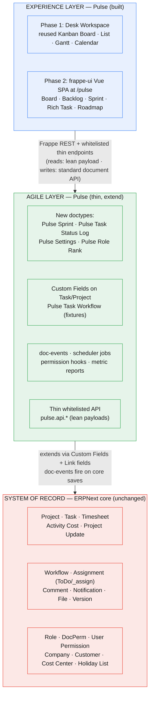
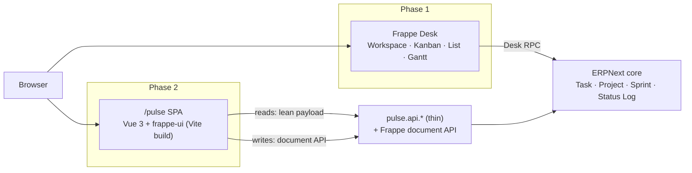
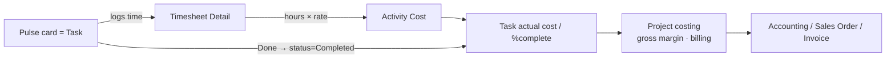
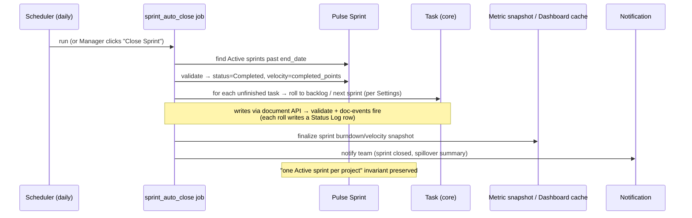

# Pulse — System Architecture

**Document 7 of 21 · System Architecture**
**Product:** Pulse — Modern Project Management for ERPNext
**Platform:** Frappe v16.25 · ERPNext v16.26
**Governing rule:** Reuse ERPNext → Extend ERPNext → Build new (only if no equivalent).

---

## 1. Purpose & scope

This document defines the technical architecture of Pulse: how the pieces fit, who owns what, and why the design is upgrade-safe. It is the bridge between the strategic analysis (Doc 0), the canonical model (`_canonical-model.md`), and the implementation docs (DB design, API, workflows) that follow.

The single architectural thesis, restated because it governs every decision below:

> **A Pulse card *is* an ERPNext Task. A Pulse project *is* an ERPNext Project. Pulse never keeps a shadow copy.** Pulse adds an *agile layer* (Sprint, Status Log, Settings, metrics, hierarchy rules) and an *experience layer* (modern UI) on top of an unchanged ERPNext core.

Everything that follows is the mechanical consequence of that thesis.

---

## 2. Three-layer architecture

Pulse is organized as three cleanly separated layers. Data ownership decreases as you move up; user experience increases. The lower a concern sits, the more it is *reused* from the framework; the higher it sits, the more it is *built* by Pulse — and Pulse deliberately spends almost its entire custom-code budget in the top layer.



### 2.1 Layer 1 — System of Record (ERPNext core, unchanged)

The authoritative data layer. It owns every fact that has financial or operational weight: what a project costs, who logged which hour, what a task's status is for closure and billing. Pulse treats this layer as **read-authoritative and write-through** — it never edits core files and never bypasses core validation.

Owns: Project, Task (with `parent_task`, `is_group`, `depends_on`, `type`, `priority`, `status`, `exp_start_date`/`exp_end_date`, `act_start_date`/`act_end_date`, `%complete`), Timesheet + Timesheet Detail, Activity Type/Cost, Project Update, plus the framework services (Assignment, Comments, Timeline, Attachments, Notifications, Workflow, Roles/DocPerm/User Permission, Dashboard Chart, Report engine, REST API) and master data (Company, Customer, Department, Cost Center, Holiday List, User/Employee).

### 2.2 Layer 2 — Agile Layer (Pulse, thin)

The only new *back-end* code Pulse ships. It is deliberately small and additive. It never re-implements anything the framework already does.

Owns: the four new doctypes (**Pulse Sprint**, **Pulse Task Status Log**, **Pulse Settings**, **Pulse Role Rank**), the `pulse_*` Custom Fields on Task/Project, the **Pulse Task Workflow** definition, the doc-events (status-log writer, points/velocity rollup, rank maintenance), the scheduler jobs (overdue indicator, sprint auto-close, daily metric snapshot, cache warm), the permission hooks (hierarchical assignment), and the metric reports/charts (velocity, burndown, burnup, CFD, cycle/lead time, workload).

### 2.3 Layer 3 — Experience Layer (Pulse, built)

Where the custom-code budget is spent. ERPNext's weakness is UX; Pulse's differentiator is UX. Delivered in two phases (§4): a Desk workspace stitched from reused components first, then a frappe-ui Vue SPA.

Owns: the Pulse Desk workspace (Phase 1) and the `/pulse` Vue SPA (Phase 2) — Board, Backlog, Sprint planning/execution, Rich Task pane, Roadmap.

---

## 3. Component responsibilities & tech stack

### 3.1 Responsibility matrix

| Component | Layer | Responsibility | Reuse / Extend / Build |
|---|---|---|---|
| Project, Task | Core | Work-item & container of record; costing/billing anchor | **Reuse** |
| Timesheet, Activity Cost | Core | Actual effort & rates → project costing | **Reuse** |
| Workflow engine | Core | Agile state transitions (board columns) | **Reuse (configure)** |
| Assignment (ToDo/`_assign`) | Core | Card assignees | **Reuse** |
| DocPerm / User Permission / permlevel | Core | Base RBAC, project scoping, field protection | **Reuse** |
| Report / Dashboard Chart / Number Card | Core | Rendering engine for all metrics | **Reuse** |
| Custom Fields (`pulse_*`) | Agile | Story points, sprint link, rank, epic, release, agile flags | **Extend** |
| Pulse Task Workflow | Agile | State machine Backlog→…→Done + Cancelled | **Extend (fixtures)** |
| Pulse Sprint | Agile | Iteration/time-box; velocity math | **Build (doctype)** |
| Pulse Task Status Log | Agile | Timestamped transitions for burndown/cycle-time | **Build (doctype)** |
| Pulse Settings / Pulse Role Rank | Agile | App config + role-rank map | **Build (doctype)** |
| doc-events | Agile | Status-log write, point rollup, rank | **Build (thin)** |
| Scheduler jobs | Agile | Overdue indicator, sprint auto-close, metric snapshot, cache | **Build (thin)** |
| Permission hooks | Agile | Hierarchical assign-down enforcement | **Build (thin)** |
| `pulse.api.*` | Agile | Lean read payloads; writes via document API | **Build (thin)** |
| Desk workspace (Phase 1) | Experience | Navigation + reused Kanban/List/Gantt/Calendar | **Reuse + config** |
| frappe-ui SPA (Phase 2) | Experience | Board, Backlog, Sprint, Rich Task, Roadmap | **Build** |

### 3.2 Tech stack

| Concern | Technology |
|---|---|
| Framework | Frappe v16.25 (Python 3.11+, MariaDB, Redis, RQ workers) |
| ERP domain | ERPNext v16.26 (Projects, Timesheets, Accounting) |
| Back-end language | Python — `frappe` APIs only; parameterized queries; no raw string SQL |
| Persistence | MariaDB (core Task/Project tables + 3 new Pulse tables + custom-field columns) |
| Caching / queues | Redis (cache + `frappe.enqueue` / scheduler via RQ) |
| API | Frappe REST + `@frappe.whitelist()` thin endpoints under `pulse.api.*` |
| Front-end Phase 1 | Frappe Desk (Jinja + Desk JS), reused Kanban Board doctype, workspace |
| Front-end Phase 2 | Vue 3 + **frappe-ui** SPA, Vite build, served from `www/pulse` (pattern: Gameplan, Helpdesk, Insights, Raven) |
| Data client (SPA) | `frappe-ui` resource/list-resource + `frappe.call` to `pulse.api.*` |
| Real-time (later) | Frappe socketio (`frappe.publish_realtime`) for live board updates |
| Packaging | Standard Frappe app; fixtures for custom fields, roles, workflow, task types, number cards |

---

## 4. Front-end architecture (phased)

Pulse's UX ambition (Plane-grade board, roadmap, rich task pane) exceeds what Desk JS can deliver comfortably, but the fastest route to *working software* is to reuse Desk components. Pulse therefore ships in two front-end phases, each independently shippable.

### 4.1 Phase 1 — Desk workspace + reused components (MVP)

The whole board experience is assembled from framework primitives — near-zero custom UI:

- **Pulse Desk Workspace** (a single Workspace doctype record, shipped as a fixture) provides navigation: shortcuts and links to Sprints, Backlog, Board, and the metric reports/charts.
- **Kanban Board** — reuse the Frappe core **Kanban Board** doctype, configured against **Task** with columns bound to the `workflow_state` produced by *Pulse Task Workflow* (§7 of the canonical model). Drag-and-drop, quick-add, and inline edit come for free.
- **Backlog** — a Desk List View of Task filtered to the project, ordered by `pulse_rank`, with a "move to sprint" bulk action.
- **Gantt / Calendar** — reuse Frappe's Gantt and Calendar views over Task `exp_start_date`/`exp_end_date` for a Phase-1 roadmap/timeline.
- **Rich task** — the standard Task form, with the `pulse_*` Custom Fields grouped under a "Pulse" section.

This proves the reuse-first model end-to-end (a team can run a sprint on core data) before a line of Vue is written.

### 4.2 Phase 2 — frappe-ui Vue SPA at `/pulse`

Once the model is proven, Pulse layers the modern experience on top *without changing the data*. It follows the proven Frappe SPA shape (Gameplan, Helpdesk, Insights, Raven):

- A Vue 3 + **frappe-ui** application built with Vite, its source under `pulse/frontend/` and its built assets emitted to `pulse/pulse/public/pulse/`.
- A `www/pulse/index.html` portal page (with an `index.py` context that requires login) serves the SPA at the **`/pulse`** route; a catch-all so client-side routing (`/pulse/board`, `/pulse/backlog/:sprint`, …) works.
- The SPA authenticates with the **same Frappe session/CSRF** as Desk — no custom auth. It reads via lean `pulse.api.*` endpoints and writes via the standard document API, so it obeys exactly the same permissions as Desk.
- The ERPNext **Desk remains available** for finance/ops (costing, billing, timesheets). Two experiences, one data model.



---

## 5. Thin API layer design

The API is deliberately **thin**: a few whitelisted read endpoints that return lean, board-shaped payloads, and *no* custom write endpoints — writes go through Frappe's standard document API so validation, permissions, and doc-events all fire.

### 5.1 Principles

1. **Namespace:** all endpoints live under `pulse.api.*` (e.g. `pulse.api.board.get_board`, `pulse.api.backlog.get_backlog`, `pulse.api.sprint.get_sprint_summary`). Few, lean, versioned in contract.
2. **Reads are lean.** Board/backlog endpoints call `frappe.get_list`/`frappe.get_all` with an explicit, minimal field set (only what a card needs: name, subject, `workflow_state`, `pulse_story_points`, `pulse_rank`, `_assign`, priority, `pulse_sprint`). Server-side filtering, pagination (limit/cursor), and ordering by `pulse_rank`. No N+1: assignees/points batched.
3. **Writes go through the document API.** Moving a card, editing points, or assigning uses `frappe.client.set_value` / `frappe.get_doc(...).save()` / the workflow `apply_workflow` action — never a bespoke SQL update. This guarantees permissions apply, `validate` runs, and doc-events (status log, rollup) fire.
4. **No blanket `ignore_permissions`.** This is a hard rule (it is exactly the security defect Doc 0 §A5 catalogued in the old build). Every read endpoint calls `frappe.has_permission` for doc-level access and relies on `permission_query_conditions` for row filtering; every write inherits DocPerm automatically.
5. **Validate every argument.** Whitelisted functions type-check and sanitize inputs; `sprint`, `project`, `task` args are validated as existing links the caller may access before use.
6. **Stable contract.** Endpoints are few and their shapes documented (see the API doc) so the SPA and any downstream plugin can depend on them.

### 5.2 Example read endpoint (shape)

```python
# pulse/api/board.py
import frappe

@frappe.whitelist()
def get_board(project: str, sprint: str | None = None):
    frappe.has_permission("Project", doc=project, throw=True)   # doc-level gate
    filters = {"project": project}
    if sprint:
        filters["pulse_sprint"] = sprint
    cards = frappe.get_list(                                     # lean payload only
        "Task",
        filters=filters,
        fields=["name", "subject", "workflow_state", "status",
                "pulse_story_points", "pulse_rank", "priority",
                "_assign", "pulse_sprint", "type"],
        order_by="pulse_rank asc",
        limit_page_length=0,                                     # paginate in real impl
    )
    return {"columns": _workflow_states(), "cards": cards}       # grouped client-side
```

Writes are **not** wrapped in custom endpoints — the client calls the standard `frappe.client.set_value` / workflow action, so nothing here can silently bypass permissions.

---

## 6. Doc-events (thin controllers on core Task)

Pulse hangs a small number of doc-events off the **core Task** (via `hooks.py` `doc_events`, targeting the standard `Task` doctype — no core file edits). They are pure, tested, idempotent functions.

| Event | Trigger | Action |
|---|---|---|
| **Status-log writer** | Task `on_update`, when `workflow_state` (or `status`) changed | Insert a **Pulse Task Status Log** row: `task`, `project`, `pulse_sprint`, `from_state`, `to_state`, `changed_by=frappe.session.user`, `changed_on=now`, `points_at_change=pulse_story_points`. Append-only; never edits prior rows. This is the raw material for burndown/CFD/cycle-time. |
| **Points / velocity rollup** | Task `on_update` (points or sprint or state changed) | Recompute the parent **Pulse Sprint**'s `planned_points` (sum of member tasks' points) and `completed_points` (sum where state = Done). One rollup owner — the sprint — to avoid the divergent-counter/race defect of the old build (Doc 0 §A7). |
| **Rank maintenance** | Task `before_insert` / on backlog move | Assign/normalize `pulse_rank` so ordering is stable; drag-persist debounced from the client, reconciled server-side. |
| **Done → status mapping** | On transition to workflow state `Done` | Set Task `status = "Completed"` (via workflow field mapping / doc-event) so core costing, `%complete`, and project closure behave normally. |

All are thin: they call framework APIs, do no raw SQL, and are individually unit-tested.

---

## 7. Scheduler jobs

Registered in `hooks.py` `scheduler_events`. Each is idempotent and safe to re-run.

| Job | Cadence | Behavior | Design note |
|---|---|---|---|
| **Overdue indicator** | Daily | Compute an *indicator* (derived flag / dashboard number) for tasks past `exp_end_date` and not Done/Cancelled. **Never writes Task status.** | Directly corrects the destructive nightly `UPDATE ... SET status='In Progress'` job of the old build (Doc 0 §A4). Overdue is derived, not forced. |
| **Sprint auto-close** | Daily | For each Active sprint past `end_date`: set `status=Completed`, snapshot `velocity=completed_points`, and (per settings) roll unfinished tasks to backlog or next sprint. | Enforces the "one Active sprint per project" lifecycle; writes go through the Sprint document API so `validate` fires. |
| **Daily metric snapshot** | Daily (off-peak) | Precompute burndown/burnup/velocity/CFD aggregates from Pulse Task Status Log into Dashboard Chart cache / a summary structure, so views never compute heavy metrics on render. | Fulfils the scalability/perf philosophy (Doc 0 §25–26): heavy math precomputed in background. |
| **Cache warm / evict** | Hourly / on change | Refresh cached board and sprint-summary aggregates in Redis; evict on relevant Task/Sprint change. | Keeps board < 1s for 500 cards. |

---

## 8. Caching & performance strategy

- **Lean payloads:** board/backlog endpoints fetch only card fields (§5.2), never full docs.
- **Indexes on hot columns:** Task `status`, `project`, `pulse_sprint`, `pulse_rank`; Status Log `task`, `changed_on`, `sprint` (per canonical model §3.2, §22).
- **Precompute, don't recompute:** velocity/burndown/CFD are snapshotted by the daily job into Dashboard Chart cache / summary rows; render reads the cache.
- **Redis-cached aggregates:** board grouping and sprint summaries cached with `frappe.cache()`, keyed by project+sprint, evicted on write.
- **Pagination & virtualization:** cursor/limit pagination server-side; the SPA virtualizes long backlog/board columns.
- **Optimistic UI + debounced persist:** drag-move updates the UI immediately, persists debounced via the document API, and reconciles from the server response — no per-drag full reload.
- **No app-level state:** standard Frappe multi-worker + Redis; horizontal scale is a config concern, not a code concern.

---

## 9. Integration with ERPNext accounting / billing / timesheet

This is the moat, and it is **free** precisely because the card *is* a Task.

- **Actual effort:** hours are logged as **Timesheet Detail** lines against the Task (never hand-entered in Pulse). ERPNext rolls Timesheet hours × Activity Cost rate into the Task and up to the **Project's** costing and gross-margin figures automatically.
- **Estimation vs actual:** `pulse_story_points` (estimate) lives on the Task; *actual* comes from Timesheet. Pulse never stores actual hours.
- **Closure & billing:** when a card reaches workflow state **Done**, the Done→status mapping (§6) sets Task `status = Completed`, feeding `%complete`, project closure, and any billing/Sales-Order linkage exactly as core expects.
- **Financial dimensions:** Company, Cost Center, Customer flow from the Project; Pulse adds no parallel financial fields.
- **Field-level protection:** financial fields on Task/Project are guarded by `permlevel` so delivery users (who use the board) cannot edit costing.



---

## 10. Upgrade-safety strategy

Upgrade-safety is a first-class requirement (Doc 0 §6, canonical §11). The rules:

1. **No core file edits.** Pulse never modifies files in `apps/erpnext` or `apps/frappe`.
2. **No monkey-patching core doctypes.** Behavior is added via `hooks.py` (`doc_events`, `scheduler_events`, `permission_query_conditions`, `has_permission`) — the framework's sanctioned extension points — not by overriding core classes.
3. **All additions ship as fixtures.** Custom Fields (`pulse_*`), Roles, the Pulse Task Workflow + Workflow States/Actions, Task Types, Number Cards, and the Workspace are exported as fixtures and re-applied on `bench migrate` — idempotent, guarded against collision with user customizations.
4. **Own module.** All new doctypes live in a dedicated **Pulse** module (renamed from the legacy "Project Management" module during re-baseline), so upgrades to ERPNext modules never touch Pulse.
5. **Custom fields, not table edits.** Agile attributes are *columns added via Custom Field*, never edits to core doctype JSON.
6. **CI against target versions.** Lint + tests + a clean install against the pinned Frappe/ERPNext versions guard every release.

The net effect: an ERPNext upgrade adds/upgrades core; Pulse's fixtures re-apply cleanly on top; nothing collides.

---

## 11. Proposed app folder structure (module Pulse)

```
apps/pulse/
├─ pyproject.toml · setup.py · requirements.txt · README.md
├─ pulse/                              # python package
│  ├─ hooks.py                         # app_title="Pulse"; doc_events, scheduler_events,
│  │                                   #   permission_query_conditions, has_permission,
│  │                                   #   fixtures list, website_route_rules for /pulse
│  ├─ modules.txt                      # "Pulse"
│  ├─ install.py                       # idempotent after_install (fix legacy path bug §A1)
│  ├─ patches.txt                      # migration: legacy Pulse* → core Task/Project
│  ├─ pulse/                           # module "Pulse"
│  │  ├─ doctype/
│  │  │  ├─ pulse_sprint/              # .json + .py (validate: one Active per project)
│  │  │  ├─ pulse_task_status_log/     # append-only; read-only perms
│  │  │  ├─ pulse_settings/            # Single: defaults + role_ranks table
│  │  │  └─ pulse_role_rank/           # child of Pulse Settings
│  │  ├─ workspace/
│  │  │  └─ pulse/pulse.json           # Desk workspace (Phase 1)  ← correct path
│  │  └─ workflow/                     # Pulse Task Workflow (fixture source)
│  ├─ api/                             # thin whitelisted endpoints
│  │  ├─ board.py · backlog.py · sprint.py   # lean reads; NO write endpoints, NO ignore_permissions
│  ├─ overrides/                       # doc-event handlers on core Task
│  │  └─ task_events.py                # status-log writer · rollup · rank · done→status
│  ├─ tasks.py                         # scheduler jobs (overdue indicator, sprint close, snapshot, cache)
│  ├─ permissions.py                   # hierarchical assignment: query conditions + validate
│  ├─ report/                          # velocity · burndown · burnup · CFD · cycle/lead · sprint report
│  ├─ dashboard_chart/                 # chart sources for the metrics above
│  ├─ number_card/                     # sprint/velocity number cards (fixtures)
│  ├─ fixtures/                        # custom_field.json, role.json, workflow.json,
│  │                                   #   task_type.json, workspace, number_card
│  ├─ public/
│  │  ├─ js/                           # minimal Desk client scripts (Phase 1)
│  │  └─ pulse/                        # built SPA assets (Phase 2 build output)
│  ├─ www/
│  │  └─ pulse/                        # index.html + index.py → serves the SPA at /pulse
│  └─ templates/
├─ frontend/                           # Phase 2 Vue 3 + frappe-ui source (Vite)
│  ├─ src/ (pages, components, api client) · package.json · vite.config.js
└─ docs/                               # this documentation set
```

The legacy `services/`, `scheduled/overdue.py` (destructive), `seed_data.py`, and the parallel `Pulse Project`/`Pulse Task`/… doctypes are **retired** during re-baseline (Doc 0 §18, §A1–A8).

---

## 12. Sequence diagrams

### 12.1 Move a card on the board

The key point: the client persists through the **standard document / workflow API**, so permissions and doc-events fire; nothing is written by a permission-bypassing custom endpoint.

```mermaid
sequenceDiagram
    actor User
    participant SPA as Pulse SPA (frappe-ui)
    participant API as Frappe document/workflow API
    participant Task as Task (core)
    participant WF as Workflow engine
    participant Hook as Pulse doc-events
    participant Log as Pulse Task Status Log
    participant Sprint as Pulse Sprint

    User->>SPA: Drag card To Do → In Progress
    SPA->>SPA: Optimistic UI update (instant)
    SPA->>API: apply_workflow(Task, action) + set pulse_rank
    API->>WF: validate transition allowed for user's role
    WF-->>API: OK (role-gated transition passes)
    API->>Task: save() — workflow_state=In Progress
    Task->>Hook: on_update fires
    Hook->>Log: insert row (from=To Do, to=In Progress, points, user, now)
    Hook->>Sprint: recompute planned/completed points
    API-->>SPA: saved doc (new state, rank)
    SPA->>SPA: Reconcile UI with server truth
    Note over API,WF: If role not permitted, transition rejected;<br/>SPA rolls back optimistic move.
```

### 12.2 Close a sprint



---

## 13. Architectural invariants (checklist)

- The card is a Task; the project is a Project. No shadow work-item table.
- Only four new doctypes: Pulse Sprint, Pulse Task Status Log, Pulse Settings, Pulse Role Rank.
- No blanket `ignore_permissions`; writes flow through the document API.
- Board columns come from Workflow, not a custom status field.
- Overdue is a derived indicator, never a forced status write.
- Heavy metrics precomputed by scheduler, cached in Redis / Dashboard Chart.
- No core edits, no monkey-patch; everything via fixtures + hooks + own module.
- Two front-ends (Desk, `/pulse` SPA), one data model, one permission set.

---

*End of Document 7. Next: Document 8 — Data Model & DocType Design, then Document 9 — Workflows.*
