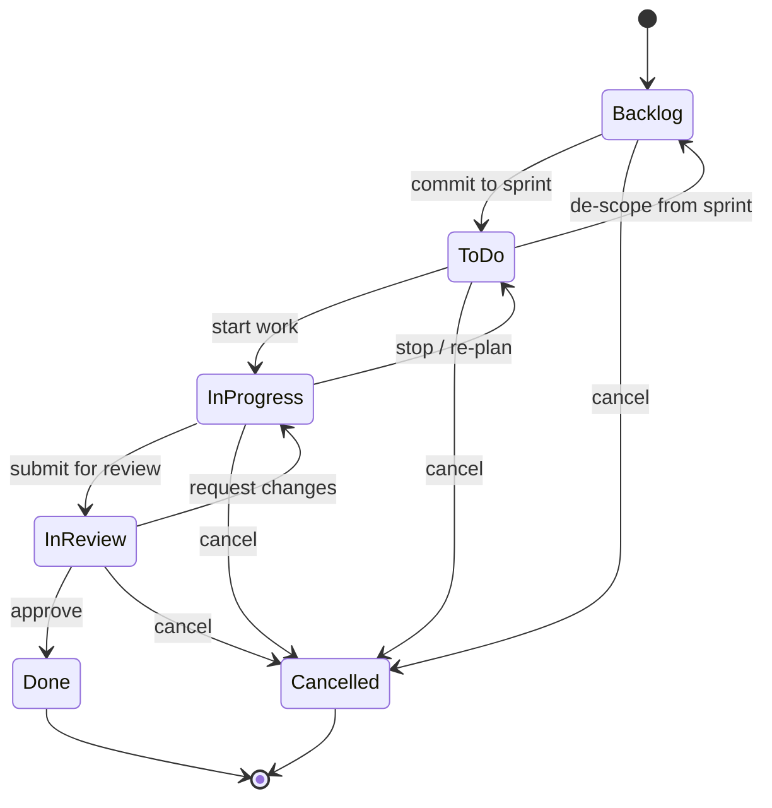
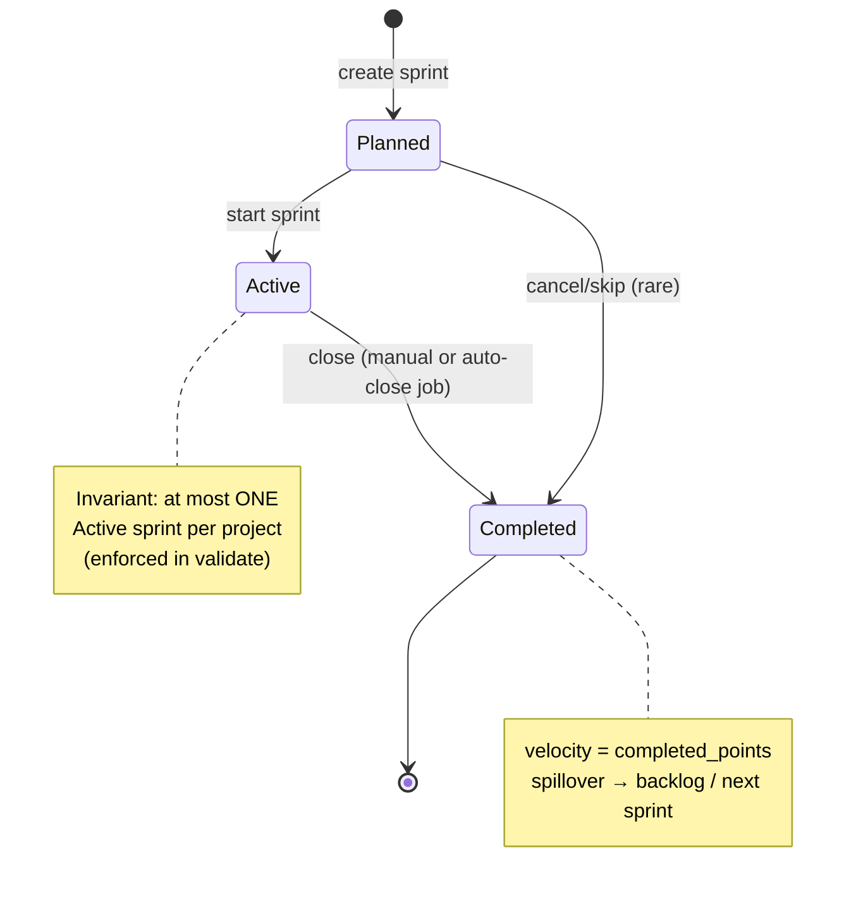
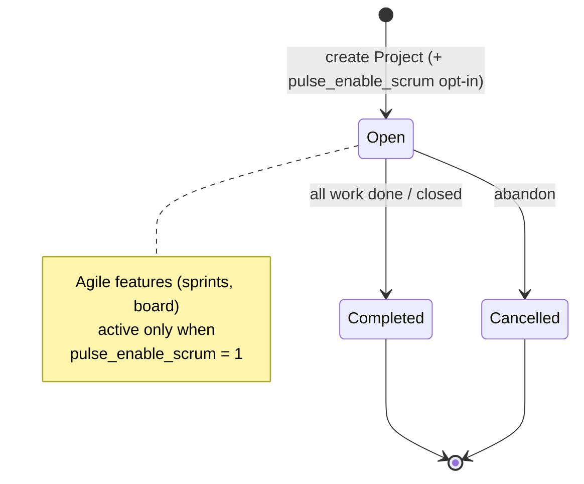
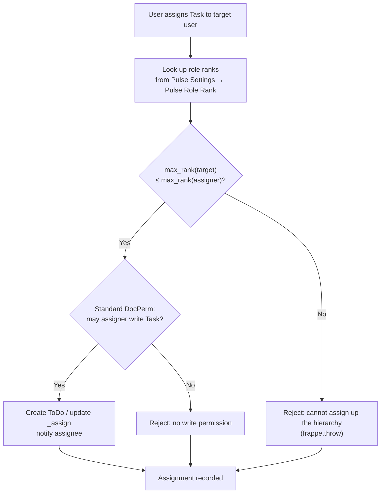

# Pulse — Workflows

**Document 9 of 21 · Workflows & Lifecycles**
**Product:** Pulse — Modern Project Management for ERPNext
**Platform:** Frappe v16.25 · ERPNext v16.26
**Governing rule:** Reuse ERPNext → Extend ERPNext → Build new (only if no equivalent).

---

## 1. Purpose & the reuse principle

This document specifies every state machine in Pulse: task workflow, sprint lifecycle, project lifecycle, assignment/hierarchy flow, and review/approval flow — plus the auto-actions and side effects each triggers.

**One principle governs all of them:**

> Pulse does **not** build a workflow engine. Every transition below runs on the **Frappe Workflow engine** (Workflow / Workflow State / Workflow Action / Workflow Transition), configured entirely via **fixtures**. Pulse ships the *configuration*, not the machinery. The framework manages the `workflow_state` field, enforces role-gated transitions, records the action, and fires doc-events — all for free.

This is the direct application of the canonical model §5 ("agile statuses via Frappe Workflow — reuse, don't add a status field") and the reuse-first thesis: board columns *are* workflow states, and the state machine *is* a fixture.

---

## 2. Pulse Task Workflow (full specification)

**Workflow name:** `Pulse Task Workflow` · **Applied to doctype:** `Task` (core) · **State field:** `workflow_state` (auto-managed by Frappe) · **Shipped as:** fixture.

### 2.1 States

| Workflow state | Board column | Meaning | Task `status` mapping |
|---|---|---|---|
| `Backlog` | Backlog | Captured, not yet committed to a sprint | `Open` |
| `To Do` | To Do | Committed to the active sprint, not started | `Open` |
| `In Progress` | In Progress | Actively being worked | `Working` |
| `In Review` | In Review | Work done, awaiting review/approval | `Pending Review` |
| `Done` | Done | Reviewed & accepted → **maps to Task `status = Completed`** for costing/closure | `Completed` |
| `Cancelled` | (hidden / archived) | Abandoned; excluded from velocity & burndown | `Cancelled` |

> **Board ↔ column ↔ status coherence.** The board renders one column per non-terminal workflow state. `Cancelled` is terminal and not shown as a working column (surfaced in an archive/filter). `Done` is the only state that drives Task `status = Completed`, which is what feeds ERPNext `%complete`, project closure, and billing (see Doc 7 §9). This keeps the three representations — workflow state, board column, and core `status` — coherent.

### 2.2 State diagram



### 2.3 Transition table

Roles reference the canonical role set (Doc 0 / canonical §6): `Pulse Admin`, `Pulse Manager`, `Pulse Team Lead`, `Pulse Senior Developer` (Sr Dev), `Pulse Junior Developer` (Jr Dev), `Pulse Viewer`. "Assignee" means a user in the Task `_assign`. All role gating is enforced by the **Frappe Workflow** `allowed` role on each transition — never in the UI only.

| # | From state | To state | Action label | Allowed roles | Conditions | Post-action (side effects) |
|---|---|---|---|---|---|---|
| 1 | Backlog | To Do | Commit to Sprint | Manager, Team Lead | Task has a `pulse_sprint`; that sprint is `Active` | Status Log row; sprint `planned_points` rollup |
| 2 | To Do | In Progress | Start | Assignee, Sr Dev, Team Lead, Manager | Task is assigned (`_assign` non-empty) | Status Log row; cycle-time start captured |
| 3 | In Progress | In Review | Submit for Review | Assignee, Sr Dev, Team Lead, Manager | — | Status Log row; notify reviewer |
| 4 | In Review | Done | Approve | Team Lead, Manager (reviewer ≠ author preferred) | Review passed | Status Log row; **Task `status = Completed`**; sprint `completed_points` rollup; `%complete=100` |
| 5 | In Review | In Progress | Request Changes | Team Lead, Manager, Sr Dev | — | Status Log row; notify assignee |
| 6 | In Progress | To Do | Stop / Re-plan | Team Lead, Manager | — | Status Log row |
| 7 | To Do | Backlog | De-scope | Manager, Team Lead | — | Status Log row; sprint `planned_points` rollup down |
| 8 | Backlog / To Do / In Progress / In Review | Cancelled | Cancel | Manager, Admin | — | Status Log row; **Task `status = Cancelled`**; excluded from velocity/burndown |

**Notes:**
- Jr Dev / Intern can be *assignees* and thus perform transitions 2–3 on their own tasks, but cannot commit/approve/cancel (transitions 1, 4, 8) — those are lead/manager-gated.
- `Pulse Viewer` has no transition rights (read-only).
- Every transition's post-action includes writing a **Pulse Task Status Log** row via the Task `on_update` doc-event (Doc 7 §6) — this is the raw data for burndown, CFD, and cycle/lead time.

### 2.4 Done → costing/closure mapping (why it matters)

Reaching `Done` is not just a board move. The workflow's field mapping / doc-event sets the **core Task `status = Completed`**, which:
- sets `%complete = 100`,
- lets ERPNext roll the task into **Project** costing/closure,
- keeps billing / Sales-Order linkage behaving exactly as core expects.

This is the mechanism by which the agile board stays financially integrated without any parallel costing logic.

---

## 3. Sprint lifecycle

**Doctype:** `Pulse Sprint` · **States:** `Planned` → `Active` → `Completed` · state stored in the Sprint's `status` Select field, transitions governed by a lightweight Frappe Workflow on `Pulse Sprint` (fixture) plus `validate` rules.

### 3.1 Rules

- **One Active sprint per project** — enforced in `Pulse Sprint.validate` (setting a sprint `Active` while another is Active for the same project raises).
- **Auto-close** — the daily `sprint_auto_close` scheduler job (Doc 7 §7) moves Active sprints past `end_date` to `Completed`, snapshots `velocity = completed_points`, and rolls spillover per Pulse Settings.
- **Velocity** is captured at close (read-only, computed).

### 3.2 Diagram



| From | To | Trigger | Allowed roles | Conditions | Post-action |
|---|---|---|---|---|---|
| Planned | Active | Start Sprint | Manager, Team Lead | No other Active sprint in project; `start_date`/`end_date` set | Committed tasks → `To Do`; `planned_points` computed |
| Active | Completed | Close Sprint | Manager, Team Lead, or auto-close job | — | `velocity = completed_points`; spillover rolled; metric snapshot; team notified |

---

## 4. Project lifecycle

Pulse **reuses the core ERPNext Project lifecycle** — it does not add a project workflow. The Project's native `status` drives it; Pulse only adds the `pulse_enable_scrum` opt-in and related agile settings (canonical §4).



- **Open** — active project; if `pulse_enable_scrum = 1`, sprints and the board apply.
- **Completed / Cancelled** — core ERPNext states; costing/closure handled by ERPNext.
- Progressive disclosure: agile complexity appears only for scrum-enabled projects.

---

## 5. Assignment / hierarchy workflow (assign-down enforcement)

Assignment reuses Frappe **Assignment (ToDo / `_assign`)**. Pulse adds **one** additional constraint: a user may assign work only **down or sideways** the role hierarchy — never up. This is policy over existing permissions, enforced **server-side** (canonical §6), never UI-only.

Ranks come from **Pulse Role Rank** rows in **Pulse Settings** (higher = more senior): Admin 100, Manager 80, Team Lead 60, Sr Dev 40, Jr Dev 20, Intern 10, Viewer 0.

**Rule:** `max_rank(assignee) ≤ max_rank(assigner)`.

Enforced in two places:
- **`validate` / assignment hook** — blocks an assignment where the target's max rank exceeds the assigner's max rank.
- **`permission_query_conditions`** — scopes list/board results to what the user may access, so the UI only ever offers valid targets.



Base DocType permissions still come from standard DocPerm; the hierarchy rule is an **additional** constraint, not a replacement. Financial fields stay protected via `permlevel`.

---

## 6. Review / approval flow

Review is the `In Progress → In Review → Done` segment of the Task Workflow (§2), expressed as first-class transitions rather than a separate engine.

```mermaid
sequenceDiagram
    actor Dev as Assignee (Sr/Jr Dev)
    actor Rev as Reviewer (Team Lead / Manager)
    participant WF as Frappe Workflow
    participant Task as Task
    participant Hook as Pulse doc-events
    participant Log as Status Log

    Dev->>WF: Submit for Review (In Progress → In Review)
    WF->>Task: workflow_state = In Review
    Task->>Hook: on_update → write Status Log; notify reviewer
    Rev->>WF: Approve (In Review → Done)
    alt Approved
        WF->>Task: workflow_state = Done → status = Completed
        Task->>Hook: Status Log; completed_points rollup; %complete=100
    else Request changes
        Rev->>WF: Request Changes (In Review → In Progress)
        WF->>Task: workflow_state = In Progress
        Task->>Hook: Status Log; notify assignee
    end
```

- Approval is **role-gated** (Team Lead / Manager) by the workflow transition's `allowed` role.
- "Request Changes" loops the card back to `In Progress`, keeping a full audit trail via Status Log rows and the core Version/timeline.
- Reaching `Done` triggers the costing/closure mapping (§2.4).

---

## 7. Auto-actions & side effects (summary)

Every transition above produces deterministic side effects, all via **doc-events on the core Task** (Doc 7 §6) — no bespoke engine:

| Side effect | Fired on | Purpose |
|---|---|---|
| **Status Log write** | Every workflow-state change | Append-only Pulse Task Status Log row (from/to state, points snapshot, user, timestamp) → burndown, burnup, CFD, cycle/lead time |
| **Point / velocity rollup** | Commit, approve, de-scope, cancel | Recompute Sprint `planned_points` / `completed_points` (single owner: the Sprint) |
| **Done → status=Completed** | Transition to `Done` | Core costing, `%complete`, project closure, billing |
| **Cancel → status=Cancelled** | Transition to `Cancelled` | Exclude from velocity/burndown; core closure |
| **Notifications** | Submit-for-review, request-changes, approve, sprint close | Reuse Frappe Notification / Email |
| **Spillover roll** | Sprint close | Unfinished tasks → backlog / next sprint per Pulse Settings |

All side effects are idempotent, unit-tested, and rely on framework primitives.

---

## 8. Workflow invariants (checklist)

- All state machines run on the **Frappe Workflow engine**, configured via **fixtures** — no custom engine.
- Board columns = workflow states; `Done` = core `status=Completed`; `Cancelled` excluded from metrics.
- Transitions are **role-gated by the workflow's `allowed` role**, enforced server-side.
- Every transition writes an append-only **Status Log** row (metrics source).
- One **Active** sprint per project; auto-close snapshots velocity.
- Project lifecycle is **reused** from core ERPNext; agile is opt-in via `pulse_enable_scrum`.
- Assignment adds an **assign-down** hierarchy rule on top of standard DocPerm, enforced in `validate` + `permission_query_conditions`.

---

*End of Document 9. Next: Document 10 — Permissions & Roles.*
