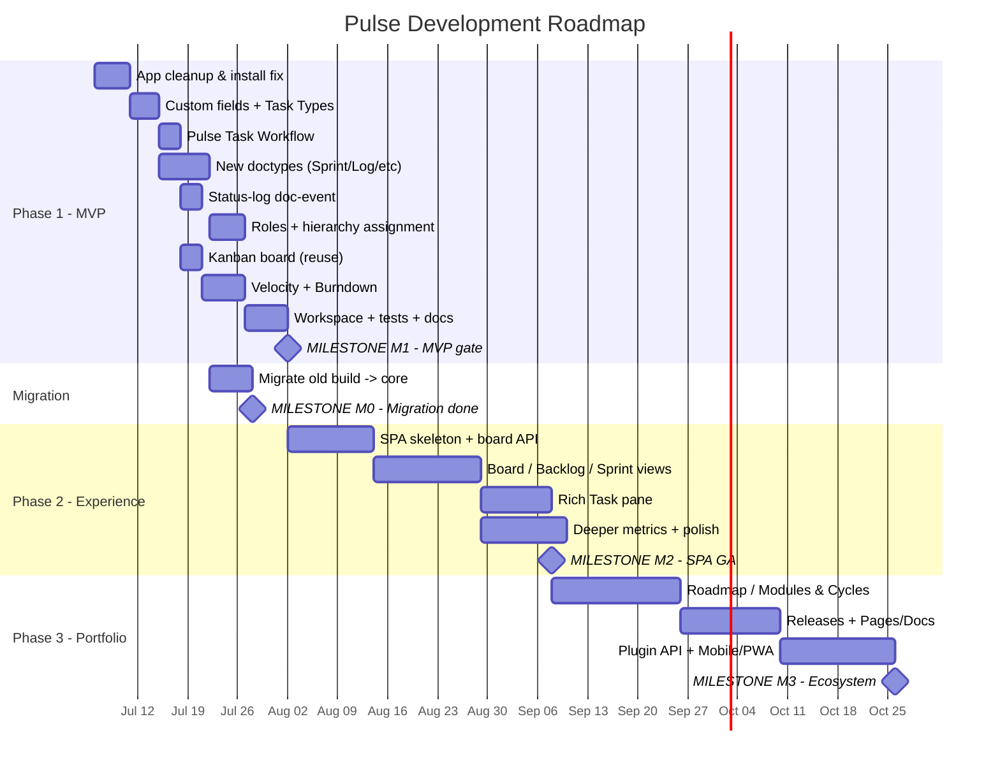

# Pulse — Development Roadmap

**Document 15 of 21**
**Product:** Pulse — Modern Project Management for ERPNext
**Platform:** Frappe v16.25 · ERPNext v16.26 · App `pulse` · Module `Pulse`
**Governing rule:** Reuse ERPNext → Extend ERPNext → Build new (only if no equivalent).

---

## 0. How to read this document

This roadmap operationalizes the authoritative phase plan in `_canonical-model.md` §10 and the development strategy in `00-Pulse-Enterprise-Analysis.md` §30–§33. It breaks the three phases into **epics**, each with deliverables, **exit/acceptance criteria**, dependencies, rough effort, and a concrete **build order**. It also includes a milestone gantt, a sprint-by-sprint plan for building Pulse itself in Phase 1, and the one-time **migration-from-old-build** milestone.

Every item obeys the reuse gate: *"Does ERPNext/Frappe already do this?"* Only **Pulse Sprint**, **Pulse Task Status Log**, **Pulse Settings**, and **Pulse Role Rank** are new doctypes. Everything else is a custom field, fixture, workflow, report, or SPA view over core Task/Project.

---

## 1. Phase overview

| Phase | Theme | Outcome | Rough duration |
|---|---|---|---|
| **Phase 1** | Reuse-First Foundation (MVP) | A team runs a sprint end-to-end on core Task/Project with a modern-enough board, burndown, and velocity — almost no custom UI. | ~8–10 weeks (4–5 sprints) |
| **Phase 2** | Modern Experience | Frappe-UI (Vue 3) SPA: Board / Backlog / Sprint / Rich Task; deeper metrics; board polish. | ~10–14 weeks |
| **Phase 3** | Portfolio & Ecosystem | Roadmap/Timeline, Modules & Cycles, Releases, Pages/Docs, automations, plugin API, mobile/PWA. | ~12–16 weeks |

Phases are strictly sequential at the gate level, but each phase ships **vertical, usable slices**. The Phase 1 exit gate ("prove the model on core data") must pass before Phase 2 SPA work begins.

---

## 2. Phase 1 — Reuse-First Foundation (MVP)

**Goal (canonical §31):** a team can plan → run → close a sprint on ERPNext Task/Project data, see a board (reused Frappe Kanban Board), and read burndown + velocity. Financial integration is inherited automatically because every card *is* a Task.

### 2.1 Epics

| Epic | Description | Reuse / Extend / Build |
|---|---|---|
| **P1-E1 · App cleanup & rebrand** | `app_title` → "Pulse"; module → **Pulse**; fix the install path bug; remove/retire parallel `Pulse *` doctypes from the active path; idempotent install hooks. | Fix |
| **P1-E2 · Core extensions (fixtures)** | Custom fields on Task (`pulse_story_points`, `pulse_sprint`, `pulse_epic`, `pulse_rank`, `pulse_release`, `pulse_section`) and Project (`pulse_enable_scrum`, `pulse_board_type`, `pulse_default_sprint_length`, `pulse_project_key`, `pulse_section`). | Extend |
| **P1-E3 · Task Types** | Task Type fixtures: Epic, Story, Bug, Task, Sub-task, Improvement, Incident, Feature. | Extend (reuse Task.type) |
| **P1-E4 · Pulse Task Workflow** | Frappe Workflow on Task: `Backlog → To Do → In Progress → In Review → Done` (+ `Cancelled`); `Done` maps Task `status=Completed`. | Reuse (Workflow) |
| **P1-E5 · New doctypes** | Pulse Sprint, Pulse Task Status Log, Pulse Settings (single), Pulse Role Rank (child). | Build (only justified additions) |
| **P1-E6 · Doc-events** | `on_update` writer that appends a Pulse Task Status Log row on `workflow_state`/`status` change, snapshotting `pulse_story_points` into `points_at_change`. | Build (thin) |
| **P1-E7 · Roles & hierarchical assignment** | Role fixtures + Role Ranks; `validate`/assignment hook + `permission_query_conditions` enforcing assign-down-or-sideways. | Extend |
| **P1-E8 · Board (MVP)** | Reuse Frappe **Kanban Board** keyed to `workflow_state`; quick-add, inline edit, assignees via `_assign`. | Reuse |
| **P1-E9 · Metrics** | Velocity (completed points/sprint) + Burndown (remaining points/day from Status Log + sprint dates + working days) as Script/Query Report + Dashboard Chart + Number Card. | Build on reporting engine |
| **P1-E10 · Pulse workspace** | Desk Workspace tying together Sprint, Board, Backlog list/Gantt/Calendar, metrics. | Reuse |
| **P1-E11 · Migration** | One-time script migrating old `Pulse *` data → core Task/Project + Pulse fields. | Build (one-time) |
| **P1-E12 · Tests & docs** | FrappeTestCase suites for status-log writer, hierarchy rule, velocity/burndown, one-active-sprint; install/verify docs. | Build |

### 2.2 Deliverables

- Clean `bench install-app pulse` (no FileNotFoundError; workspace loads from the correct path `.../workspace/pulse/pulse.json`).
- Fixtures: custom fields, Task Types, workflow, roles, number cards, dashboard charts, Pulse Settings defaults + default Role Ranks.
- Four new doctypes with controllers and validations.
- Status-log doc-event; hierarchical assignment enforcement.
- Working reused Kanban board; Velocity + Burndown report/chart; Pulse workspace.
- Migration script + runbook.
- Test suite green in CI; Deployment & Verify docs (Docs 16–17).

### 2.3 Exit / acceptance criteria (Phase 1 gate)

1. A user creates a Project, enables Scrum (`pulse_enable_scrum`), creates a **Pulse Sprint**, adds Tasks with story points, and moves them across the board — all as **core Task/Project rows** (no `Pulse Task`).
2. Only **one Active sprint per project** is allowed (validate rejects a second).
3. Every board move writes a **Pulse Task Status Log** row with correct `from_state`/`to_state`/`changed_on`/`points_at_change`.
4. **Burndown** and **Velocity** render correct numbers for a closed sprint.
5. A **Junior** cannot assign a Task to a **Manager**; a **Manager** can assign down — enforced server-side (fails via API, not just UI).
6. Financial rollup verified: Timesheet hours against a Pulse Task appear in Project costing unchanged.
7. No endpoint uses blanket `ignore_permissions=True`; permission tests pass.
8. Old-build migration runs idempotently on a sample dataset with a reconciliation report.
9. CI (lint + tests + install) passes against Frappe v16 / ERPNext v16.

### 2.4 Dependencies (intra-phase build order)

```
P1-E1 (cleanup/install fix)
   └─> P1-E2 (custom fields) ──┬─> P1-E4 (workflow) ──> P1-E6 (status-log doc-event) ──> P1-E9 (metrics)
                               ├─> P1-E3 (task types)
                               └─> P1-E5 (new doctypes: Sprint/StatusLog/Settings/RoleRank)
P1-E5 ──> P1-E7 (roles + hierarchy)  [needs Settings + Role Rank]
P1-E4 + P1-E5 ──> P1-E8 (Kanban board)
P1-E2..E10 ──> P1-E10 (workspace)  and  P1-E11 (migration)  and  P1-E12 (tests/docs)
```

### 2.5 Rough effort

| Epic | Effort (dev-days) |
|---|---|
| P1-E1 | 2 |
| P1-E2 | 2 |
| P1-E3 | 0.5 |
| P1-E4 | 2 |
| P1-E5 | 5 |
| P1-E6 | 2 |
| P1-E7 | 4 |
| P1-E8 | 2 |
| P1-E9 | 5 |
| P1-E10 | 2 |
| P1-E11 | 4 |
| P1-E12 | 5 |
| **Total** | **~35.5 dev-days (~7–8 weeks solo; ~4–5 two-week sprints)** |

---

## 3. Phase 2 — Modern Experience

**Goal:** replace the reused Desk board with a Plane/Jira-grade **Frappe-UI (Vue 3 + frappe-ui) SPA** at `/pulse`, and deepen metrics. Data model stays core Task/Project.

### 3.1 Epics

| Epic | Description | Bucket |
|---|---|---|
| **P2-E1 · SPA skeleton** | Vue 3 + frappe-ui app at route `/pulse` (Gameplan/Helpdesk pattern); auth via Frappe session; central API client. | Build (front-end) |
| **P2-E2 · Thin board API** | Whitelisted lean endpoints (`pulse.api.board.*`) returning pruned card payloads; writes via standard document API so permissions/doc-events fire. | Build (thin API) |
| **P2-E3 · Board view** | Modern board: DnD with `pulse_rank` persistence (debounced, optimistic), quick-add, inline edit, assignees. | Build |
| **P2-E4 · Backlog view** | Ordered backlog, drag to reorder, move-to-sprint, bulk actions. | Build |
| **P2-E5 · Sprint view** | Plan/active/close UI over Pulse Sprint; capacity from Holiday List. | Build |
| **P2-E6 · Rich Task pane** | Single-pane task detail: sub-tasks (`parent_task`), checklist, dependencies, comments, attachments, activity, story points. | Build (over core) |
| **P2-E7 · Deeper metrics** | Burnup, Cumulative Flow Diagram, Cycle/Lead time from Status Log. | Build on reporting engine |
| **P2-E8 · Board polish** | WIP limits, swimlanes, saved filters/views. | Build |
| **P2-E9 · Epics view** | Epic grouping via Task Type=Epic + `pulse_epic`. | Build |

### 3.2 Deliverables & exit criteria

- SPA served at `/pulse`; board loads **< 1s for 500 tasks** (Objective O2); DnD persists rank without races.
- Rich task pane reaches functional parity with Plane's issue view for core flows.
- Burnup, CFD, Cycle/Lead time reports validated against seeded data.
- WIP/swimlanes/saved filters usable; Epics view groups correctly.
- All writes still pass through document API (permissions + doc-events verified); e2e board tests green.

### 3.3 Dependencies

Phase 1 gate passed. `P2-E1 → P2-E2 → {P2-E3, P2-E4, P2-E5, P2-E6}`; `P2-E7` depends on Status Log (P1-E6); `P2-E8`/`P2-E9` after `P2-E3`.

### 3.4 Rough effort

~10–14 weeks (front-end heavy). SPA skeleton + board API + board view are the critical path (~5–6 weeks); remaining views/metrics parallelizable.

---

## 4. Phase 3 — Portfolio & Ecosystem

### 4.1 Epics

| Epic | Description | Reuse note |
|---|---|---|
| **P3-E1 · Roadmap / Timeline** | Portfolio planning views over Task dates + Sprint. | Enhance Gantt data |
| **P3-E2 · Modules & Cycles** | Plane-style grouping views (Modules = feature groups, Cycles = time-boxes). | Cycles reuse Pulse Sprint; Modules via Task Type/field |
| **P3-E3 · Releases + release report** | Release/version grouping (`pulse_release` → optional light Release doctype) + release notes report. | Extend + report |
| **P3-E4 · Pages/Docs** | Per-project docs. | Reuse Frappe Wiki/Web Page or light doctype |
| **P3-E5 · Automations UI** | Surface Frappe Notification / Assignment Rule / Auto-repeat in Pulse. | Reuse framework automations |
| **P3-E6 · Plugin/extension API** | Stable whitelisted API + documented doc-events (sprint close, card move) for downstream apps. | Build (contract) |
| **P3-E7 · Mobile / PWA** | Mobile-optimized SPA / PWA. | Build |
| **P3-E8 · Portfolio analytics** | Cross-project dashboards; velocity forecasting. | Build on reporting engine |

### 4.2 Exit criteria

- Roadmap and Modules/Cycles views usable at portfolio scale.
- Releases group tasks and produce a release report.
- Documented, versioned plugin API + doc-events; a sample downstream hook works.
- PWA installable; core flows usable on mobile.

### 4.3 Rough effort

~12–16 weeks. Reuse-first keeps Cycles (=Sprint), Automations, and Pages/Docs cheap.

---

## 5. Milestone chart (mermaid gantt)



---

## 6. "Build Pulse itself" — Phase 1 sprint plan

Pulse builds Pulse: we run Phase 1 as five two-week sprints, planned/tracked in Pulse's own dogfood project once the sprint doctype exists (bootstrapped manually in Sprint 1).

### Sprint 1 — Foundation & unblock install (2 weeks)
- **Goal:** app installs cleanly and is rebranded to Pulse.
- Epics: P1-E1, P1-E2, P1-E3.
- Stories: fix workspace load path bug; set `app_title` = "Pulse"; idempotent install hooks; ship custom-field fixtures (Task + Project); Task Type fixtures.
- **Sprint exit:** `bench install-app pulse` + `bench migrate` succeed; custom fields and Task Types visible; workspace opens.

### Sprint 2 — Agile primitives (2 weeks)
- **Goal:** Sprint + workflow + status history exist.
- Epics: P1-E4, P1-E5, P1-E6.
- Stories: Pulse Sprint doctype + one-active-sprint validate; Pulse Task Status Log; Pulse Settings + Role Rank; Pulse Task Workflow; status-log `on_update` writer with points snapshot.
- **Sprint exit:** creating/moving a Task through workflow writes correct Status Log rows; only one Active sprint per project.

### Sprint 3 — Governance & board (2 weeks)
- **Goal:** secure assignment + a usable board.
- Epics: P1-E7, P1-E8.
- Stories: role fixtures + default ranks; `permission_query_conditions` + assignment `validate` (assign-down); reuse Frappe Kanban Board on `workflow_state`; assignees via `_assign`.
- **Sprint exit:** hierarchy rule enforced via API; board drag changes state + logs it.

### Sprint 4 — Metrics & workspace (2 weeks)
- **Goal:** burndown + velocity visible; everything tied together.
- Epics: P1-E9, P1-E10.
- Stories: Velocity report + chart; Burndown script report (working days from Holiday List) + chart; Number Cards; Pulse workspace assembling board/backlog/sprint/metrics.
- **Sprint exit:** Phase 1 acceptance criteria #1–#6 demonstrable.

### Sprint 5 — Migration, hardening, release (2 weeks)
- **Goal:** ship v1.0.
- Epics: P1-E11, P1-E12.
- Stories: old-build → core migration script + reconciliation report; FrappeTestCase suites (status-log, hierarchy, metrics, one-active-sprint, permission, migration); CI; Deployment + Verify docs; tag `v1.0.0`.
- **Sprint exit:** M0 (migration) and M1 (MVP gate) both green; release published.

---

## 7. Migration-from-old-build milestone (M0)

The current build's parallel `Pulse *` doctypes are deprecated (canonical §1). M0 is the one-time, idempotent migration into core, scheduled inside Phase 1 (Sprint 5) after the new doctypes exist.

### Scope & mapping

| Old doctype | Migrates to | Notes |
|---|---|---|
| `Pulse Project` | **Project** + `pulse_*` fields | costing/customer preserved on core Project |
| `Pulse Task` | **Task** + `pulse_story_points`/`pulse_sprint`/`pulse_rank`/`pulse_epic` | card becomes a real Task |
| `Pulse Milestone` | **Task** (`is_milestone`/type) or Project Update | per §18 |
| `Pulse Team` / `Pulse Team Member` | Project Users / Role Profile / Department | teams via ERPNext structures |
| `Pulse Label` | Tag / `_user_tags` | no new doctype |
| `Pulse Task Dependency` | Task `depends_on` (Dependent Task) | reuse |
| `Pulse Checklist Item` | Task sub-tasks or checklist child | reuse/extend |
| `Pulse Project/Team Member` | Project User + assignment | reuse |

### Milestone acceptance

- Dry-run mode produces a mapping report (counts in vs. out) before any write.
- Migration is **idempotent** (safe re-run; guarded by a migrated-flag).
- Post-migration: costing/billing/timesheets on migrated Projects verified intact.
- Old `Pulse *` doctypes marked deprecated; retirement/removal per the deprecation policy (Doc 18).
- Rollback: documented restore-from-backup path (Doc 17) since migration is data-transforming.

### Build order for M0

`New doctypes exist (P1-E5)` → write dry-run mapper → run on sample → reconcile → run on real data in a maintenance window → verify financial rollup → mark old doctypes deprecated.

---

## 8. Cross-phase governance

- **Reuse gate at every epic:** each new item records what was reused vs. built (feeds the Reuse Matrix doc).
- **Vertical slices:** every sprint ends with something a user can do end-to-end.
- **Upgrade-safe throughout:** fixtures + custom fields + Pulse module only; zero core edits; no monkey-patching.
- **CI against target versions** (Frappe v16 / ERPNext v16) from Sprint 1.

*End of Document 15.*
